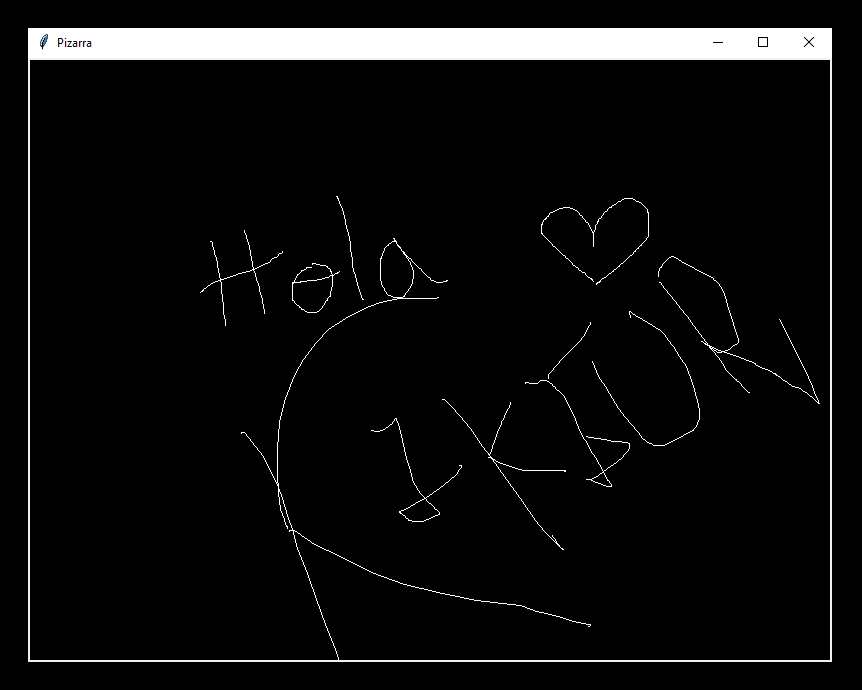

# Pizarra
 
Bienvenidos a una pizarra en Python, una herramienta que permite hacer dibujos.

## Servidor de desarrollo

Necesitamos abrir una nueva terminal, y vamos a invocar python para crear un nuevo entorno virtual, usando:
```bash
    python -m venv venv
```

Ahora apretamos las teclas, contrl shift p
escribimos Select, seleccionamos:
```bash
    Python: Select Interpreter
``` 
Y seleccionamos el enterno virtual que acabamos de crear 


Vamos a trabajar con la libreria tkinter para crear las ventanas, asi que para instalarlo en la terminal escribimos:
```bash
    pip install tk
``` 
 

## Imagen de la aplicacion 


## Licencia
 
Este proyecto está bajo la [Licencia MIT](LICENSE)

